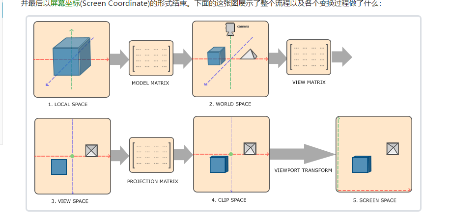
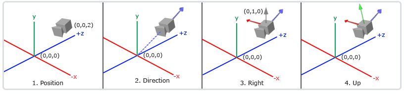
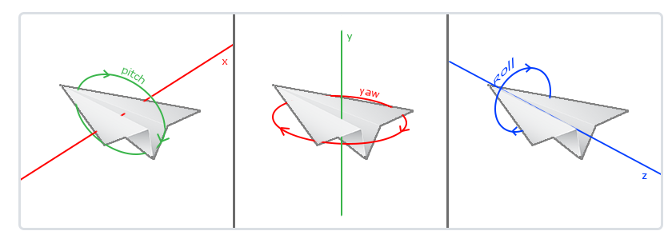
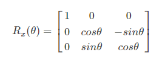
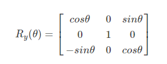
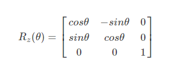
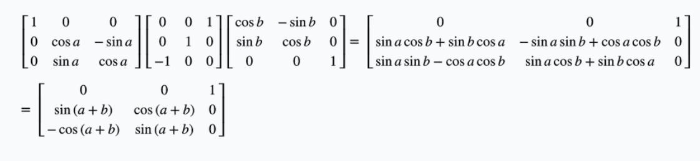
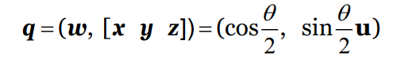
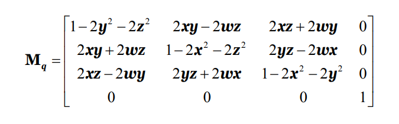

# 摄像机

### 知识回顾
在坐标系统这一课中，我们学习了关于坐标变化的一系列的内容

其中的几点需要我们复习一下

>* **M**odel Matrix : 将物体的局部坐标转化为世界坐标
>* **V**iew Matrix : 将世界坐标转换为摄像机坐标
>* **P**roject Matrix : 将摄像机坐标转化为裁剪空间坐标
>* Viewport Transform : 从裁剪空间转化为屏幕

### View Matrix
即一个新的以单位轴互相垂直，以摄像机位置为原点的坐标系。定义如下：

View矩阵来完成这次坐标变化

### Look At
用三个参数来构建 View Matrix 的内置函数
>* eye : 摄像机的位置
>* at ： 目标位置
>* up ： up向量
---
其中，用 at - eye 来获得 front， 用 front X up 来获得 right

### 移动
移动的核心，其实就是通过改变 eye, at, up, 来实现摄像机的变化
>* 左右移动 ：改变 eye 的位置（移动 right 的若干倍）
>* Zoom In/Out : 改变 eye 的位置 （移动 front 的若干倍）
>* 绕y轴旋转 ：eye 在 front-right平面上 绕 at 点做环绕，front，up 不变
>* 绕x轴旋转 ：eye 在 front-up平面上 绕 at 点做环绕，front，right 不变

### 欧拉角 & 万向节锁

其对应矩阵
>* x*

>* y*

>* z*

---
假设旋转顺序为 x -> y -> z, 当取 y 的旋转角为 90 时， 有

可得，任一向量 [x, y, z]T， 都有 [x2, y2, z2]， 其中 x2 = z，丢失一个旋转轴

### 四元数
---
>* 我们可以把一个旋转序列等价于单次的旋转，任何不带位置和方向的角度变化，都可以合并成一次绕轴旋转
>* 绕单位轴 u 旋转 θ 角，被记为 四元数 q

---
其对应矩阵为：

