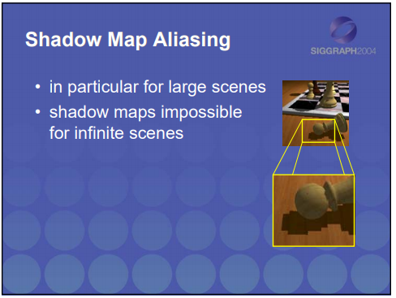
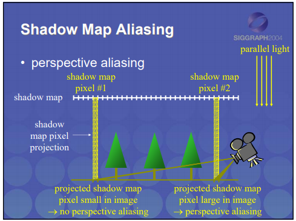
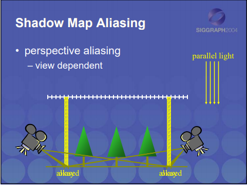
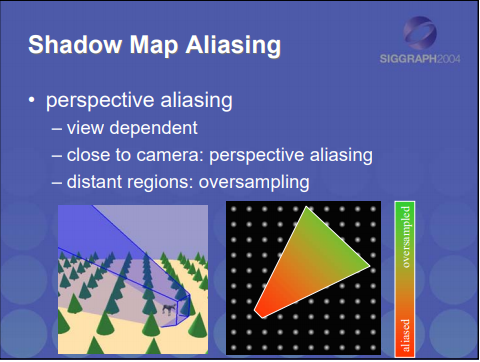
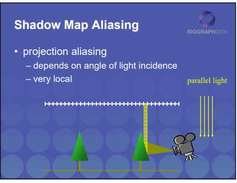
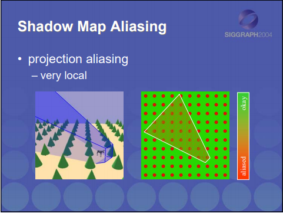
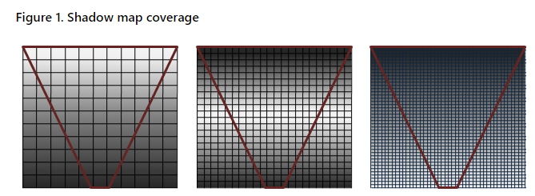
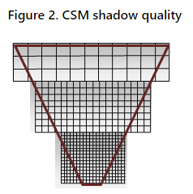

# Cascaded Shadow Map
*本章学习内容有大量的外链参考，配合食用效果更佳*

[微软CSM文档](https://docs.microsoft.com/en-us/windows/desktop/dxtecharts/cascaded-shadow-maps)

[个人修改后的 DX SDK Sample](https://github.com/YuMoZhiChu/directx-sdk-samples)

[perspective aliasing](http://jankautz.com/courses/ShadowCourse/03-PerspectiveSM.pdf)

## CSM On DX Sample

### What is CSM？

```
Cascaded shadow maps (CSMs) are 
the best way to combat 
one of the most prevalent errors with shadowing: 
perspective aliasing. 
```

CSM 是解决 透视走样 (perspective aliasing) 的最好方法。

#### perspective aliasing



锯齿状的问题，就是精度不够





跟摄像机视角有关



过近： 精度不够， 过远： 超采样





入射光的方向，以及物体的形状，都会影响

#### basic concept
```
The basic concept of CSMs is easy to understand.
Different areas of the camera frustum require shadow maps with different resolutions.
Objects nearest the eye require a higher resolution than do more distant objects. 
In fact, when the eye moves very close to the geometry, 
the pixels nearest the eye can require so much resolution that even a 4096 × 4096 shadow map is insufficient.
```



>* 不同的视椎体需要不同分辨率的阴影贴图。
>* 距离眼睛越近，需要的精度越高，反之亦然。

```
The basic idea of CSMs is to partition the frustum into multiple frusta. A shadow map is rendered for each subfrustum;
the pixel shader then samples from the map that most closely matches the required resolution 
```




