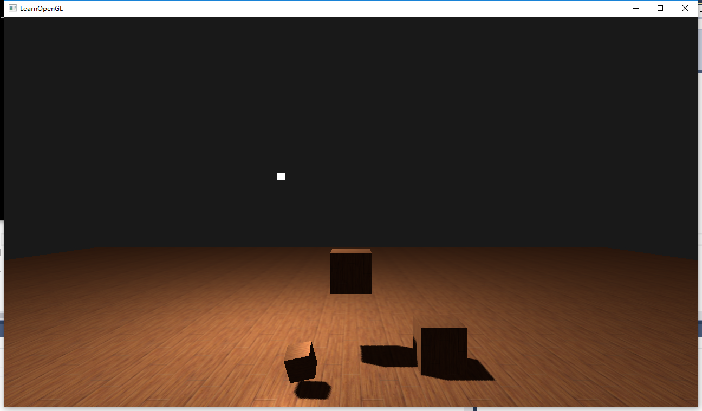

# 点光源阴影

### 知识回顾
上一个知识点中，有一个疑惑点，面剔除究竟为何能优化阴影映射算法。于是做了一波拓展

#### 最初的SM算法：


理解:
>* 深度贴图 - 绘制的为物体的表面
>* 阴影计算渲染时，计算的为物体的表面

结果:


有明显的冲突纹理。

#### 使用bias做偏移


理解:
>* 加上偏移后，实际 = 物体向光源出做了一小段位移

结果:


有上浮偏移。

#### 使用剪切的方法，取背面


理解:
>* 使用剪切后，对于有厚度的物体，相当于选择离光源更远的一面绘制阴影

结果：



在接合处，有漏光。


#### 使用剪切后，使用负偏移

修正:
>* 缝隙的原因，对于靠近物体边界的片元，也就是靠近选择绘制深度贴图的一面，同样有


初步修正，减去偏移量，结果：


有抖动的现象


理解:
>* 当负偏移取得过大时，对于靠近选择深度贴图的光的一面，偏移量就会导致阴影。

现在的问题变成了，对于2处片元，我们应该采取不同的策略。


修正:
>* 记录2张深度信息，near & far
>* 观察可以发现，当 near 和 far 相接近时，则处于边角的区域，这是bias应该越小
bias的选取：
```c++
bias = min(FarDepth - NearDepth, 0.005f);
```

效果:


>* 虽然仍有瑕疵，但控制在了可以接受的范围内。

### 点光源的做法

SM算法 + CubeMap 应用 = 点光源

#### 声明深度立方体贴图

*参考CubeMap中的使用*

1. 生成帧缓冲和纹理的索引
```C
GLuint depthMapFBO;
glGenFramebuffers(1, &depthMapFBO);
...
GLuint depthCubemap;
glGenTextures(1, &depthCubemap);
```

2. 绑定CUBE_MAP, 并进行属性设置
```C
const GLuint SHADOW_WIDTH = 1024, SHADOW_HEIGHT = 1024;
glBindTexture(GL_TEXTURE_CUBE_MAP, depthCubemap);
for (GLuint i = 0; i < 6; ++i)
        glTexImage2D(GL_TEXTURE_CUBE_MAP_POSITIVE_X + i, 0, GL_DEPTH_COMPONENT, 
                     SHADOW_WIDTH, SHADOW_HEIGHT, 0, GL_DEPTH_COMPONENT, GL_FLOAT, NULL);
```
*GL_TEXTURE_CUBE_MAP_POSITIVE_X 这个值按照顺序一直到 NEGATIVE_Z*

3. 纹理参数设置
```
glTexParameteri(GL_TEXTURE_CUBE_MAP, GL_TEXTURE_MAG_FILTER, GL_NEAREST);
glTexParameteri(GL_TEXTURE_CUBE_MAP, GL_TEXTURE_MIN_FILTER, GL_NEAREST);
glTexParameteri(GL_TEXTURE_CUBE_MAP, GL_TEXTURE_WRAP_S, GL_CLAMP_TO_EDGE);
glTexParameteri(GL_TEXTURE_CUBE_MAP, GL_TEXTURE_WRAP_T, GL_CLAMP_TO_EDGE);
glTexParameteri(GL_TEXTURE_CUBE_MAP, GL_TEXTURE_WRAP_R, GL_CLAMP_TO_EDGE);
```

4. 将纹理（depthCubemap）附着（attach）到目标上（depthMapFBO）

将纹理图像附加到当前绑定的framebuffer对象的逻辑缓冲区之一。

```
glBindFramebuffer(GL_FRAMEBUFFER, depthMapFBO);
glFramebufferTexture(GL_FRAMEBUFFER, GL_DEPTH_ATTACHMENT, depthCubemap, 0);
glDrawBuffer(GL_NONE);
glReadBuffer(GL_NONE);
glBindFramebuffer(GL_FRAMEBUFFER, 0);
```
*略有不同的一点，glFramebufferTexture2D VS glFramebufferTexture*


#### 光空间的变换

1. 定义透视投影矩阵
```
GLfloat aspect = (GLfloat)SHADOW_WIDTH/(GLfloat)SHADOW_HEIGHT;
GLfloat near = 1.0f;
GLfloat far = 25.0f;
glm::mat4 shadowProj = glm::perspective(glm::radians(90.0f), aspect, near, far);
```
*问题: 为什么使用透视投影，使用正交投影会有什么效果。*

2. 构建6个坐标系
```
std::vector<glm::mat4> shadowTransforms;
shadowTransforms.push_back(shadowProj * 
                 glm::lookAt(lightPos, lightPos + glm::vec3(1.0,0.0,0.0), glm::vec3(0.0,-1.0,0.0));
shadowTransforms.push_back(shadowProj * 
                 glm::lookAt(lightPos, lightPos + glm::vec3(-1.0,0.0,0.0), glm::vec3(0.0,-1.0,0.0));
shadowTransforms.push_back(shadowProj * 
                 glm::lookAt(lightPos, lightPos + glm::vec3(0.0,1.0,0.0), glm::vec3(0.0,0.0,1.0));
shadowTransforms.push_back(shadowProj * 
                 glm::lookAt(lightPos, lightPos + glm::vec3(0.0,-1.0,0.0), glm::vec3(0.0,0.0,-1.0));
shadowTransforms.push_back(shadowProj * 
                 glm::lookAt(lightPos, lightPos + glm::vec3(0.0,0.0,1.0), glm::vec3(0.0,-1.0,0.0));
shadowTransforms.push_back(shadowProj * 
                 glm::lookAt(lightPos, lightPos + glm::vec3(0.0,0.0,-1.0), glm::vec3(0.0,-1.0,0.0));
```

#### 深度着色器

1. gl_Layer 内建变量
```
几何着色器有一个内建变量叫做gl_Layer，它指定发散出基本图形送到立方体贴图的哪个面。
```

```C
...
for(int face = 0; face < 6; ++face)
    {
        gl_Layer = face; // built-in variable that specifies to which face we render.
        for(int i = 0; i < 3; ++i) // for each triangle's vertices
        {
            FragPos = gl_in[i].gl_Position;
            gl_Position = shadowMatrices[face] * FragPos;
            EmitVertex();
        }    
        EndPrimitive();
    }
...
```

2. 自行计算深度, 并通过 far_plane 远平面的值，映射到 [0-1] 中
```C
    // get distance between fragment and light source
    float lightDistance = length(FragPos.xyz - lightPos);

    // map to [0;1] range by dividing by far_plane
    lightDistance = lightDistance / far_plane;

    // write this as modified depth
    gl_FragDepth = lightDistance;
```
在这里，远平面 **far_plane** 决定了你的阴影贴图的精度。

#### 万向阴影贴图
1. 采样，其实就是 CubeMap 的采样


2. 当前片元深度计算

阴影贴图的内容为：深度距离 / far_plane -> [0, 1]

小技巧：


这里直接使用：当前片元 与 光源距离，不做除法，而是采样结果做乘法。

#### 为什么使用 90° FOV的透视投影？

先来看看平行投影的效果


可以看到，有个正方体在3个面上都有阴影，是因为我们绘制平行投影对应的深度贴图时，6个面都相应绘制了一次。

个人疑惑:
试了下调整透视投影的FOV参数，得到了非常奇怪的一组效果。


*总结不出原因，但确实是不对的！*

个人总结：
>* 保证CubeMap正常。
*虽然移动光源后，还是会出现问题*

### 