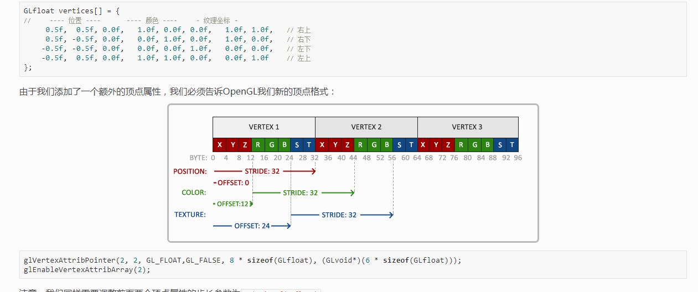
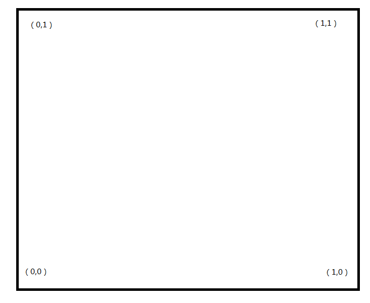
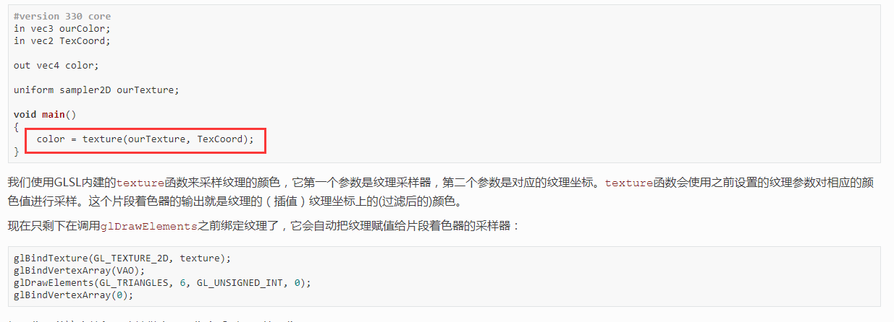
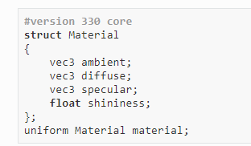
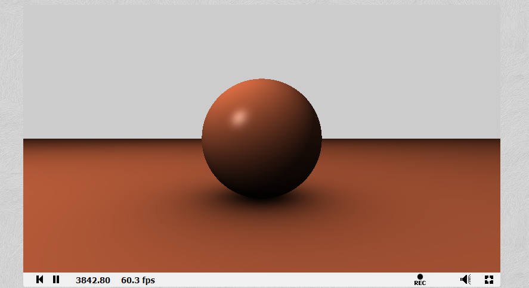
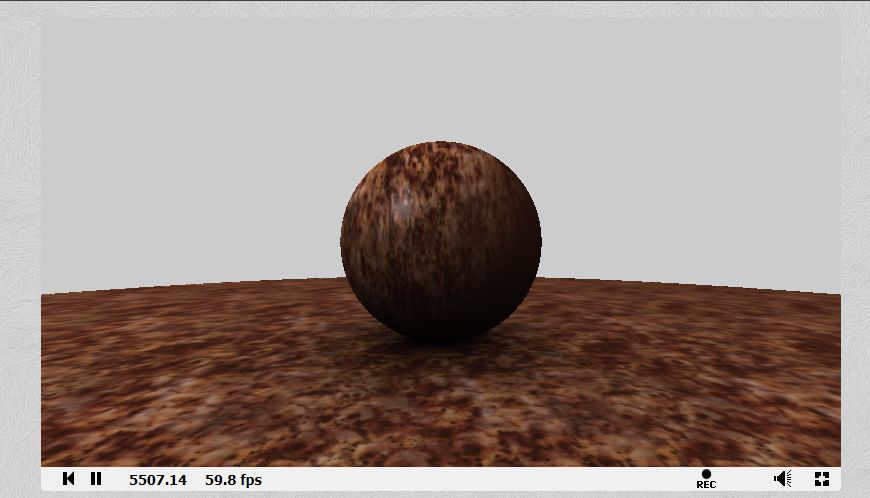

# 材质

### 知识回顾
在纹理这一课中，我们学习了关于纹理贴图如何使用的方法

>* 将纹理坐标的信息存储到VAO中



如此，正方形的4个顶点分别对应着



>* 在像素着色器中使用 texture 函数采样



如此，便将一张图片附着在正方形上。

### 材质定义
以对光的描述来定义材质，这也是冯氏光照模型的特点。



其中

>* **ambient**   : 环境光，是一个非常的小的亮度，单纯的环境光的效果相当于，在昏暗的环境中的大致颜色。
>* **diffuse**   : 漫反射，基础色，主要表现的颜色。
>* **specular**  : 高光点。
>* **shininess** : 高光参数。

所谓材质，即这一套在实际上的表现。

### 参数调整
首先我们在 [shadertoy](https://www.shadertoy.com/) 上看看用教程上的例子的效果:

>* 光照参数

``` C++
mat3 PhongLight = mat3( 0.2,  0.2,  0.2,	// ambient
					0.8,  0.8, 0.8,			// diffuse
					1.0, 1.0, 1.0 );		// specular
vec3 LightPos = vec3(10.0, 10.0, 10.0);
```
>* 材质参数
``` C++
mat3 CuMaterial = mat3( 1.0,  0.5,  0.31,	// ambient
					1.0,  0.5,  0.31,		// diffuse
					0.5, 0.5, 0.5);			// specular
#define Cu_shininess 32.0
```
>* 对应的渲染流程
``` C++
		// Phong Light
		
		// ambient
		vec3 ambient = PhongLight[P_ambient] * CuMaterial[P_ambient];

		// diffuse
		if (nor != vec3(0.0, 1.0, 0.0)) nor = normalize(pos - sphere_center);
		vec3 lightDir = normalize(LightPos - pos);
		float diff = max(dot(nor, lightDir), 0.0);
		vec3 diffuse = PhongLight[P_diffuse] * (diff * CuMaterial[P_diffuse]);

		// Specular
		vec3 viewDir = normalize(eye - pos);
		vec3 reflectDir = reflect(-lightDir, nor);
		float spec = pow(max(dot(viewDir, reflectDir), 0.0), Cu_shininess);
		vec3 specular = PhongLight[P_specular] * (spec * CuMaterial[P_specular]);

		vec3 result = ambient + diffuse + specular;
```
>* 结果



>* 附上全部代码，并在 [shadertoy](https://www.shadertoy.com/) 做些修改。
``` C++
// the light input

mat3 PhongLight = mat3( 0.2,  0.2,  0.2,	// ambient
					0.8,  0.8, 0.8,			// diffuse
					1.0, 1.0, 1.0 );		// specular

mat3 CuMaterial = mat3( 1.0,  0.5,  0.31,	// ambient
					1.0,  0.5,  0.31,		// diffuse
					0.5, 0.5, 0.5);			// specular

#define P_ambient  0
#define P_diffuse  1
#define P_specular 2

#define Cu_shininess 32.0

vec3 LightPos = vec3(10.0, 10.0, 10.0);

void mainImage( out vec4 fragColor, in vec2 fragCoord )
{
	vec2 pos2D = (-iResolution.xy + 2.0*fragCoord.xy) / iResolution.y;
	
	// camera param
	vec3 eye = vec3( 3.5, 1.0, 0.0 );
	vec3 at = vec3( 0.0, 1.0, 0.0 );
	vec3 up = vec3( 0.0, 1.0, 0.0 );

	// camera matrix
    vec3 front = normalize( at - eye );
    vec3 right = normalize( cross(front,up));

    // create view ray
	vec3 view_ray = normalize( pos2D.x*right + pos2D.y*up + 1.5*front );

	// sphere center	
	vec3 sphere_center = vec3(0.0,1.0,0.0);


	// raytrace
	float tmin = 10000.0;
	vec3  nor = vec3(0.0);
	float occ = 1.0;
	vec3  pos = vec3(0.0);
	
	// raytrace-plane
	float h = (0.0 - eye.y)/view_ray.y;
	if (h > 0.0)
	{
		tmin = h;
		// cal the shadow on plane
		nor = vec3(0.0,1.0,0.0);
		// 恰好 pos.y == 0, 而h恰好能当做到对应位置的坐标
		pos = eye + h*view_ray;

		vec3 di = sphere_center - pos;
		float l = length(di);
		occ = 1.0 - dot(nor,di/l)*1.0*1.0/(l*l);
		// 一个很简单的阴影算法, dot(nor,di/l) 代表圆在plane上的投影
		// 除上 l*l 表示, 越远投影的值越小
	}

	// raytrace-sphere
	vec3 center2eye = eye - sphere_center;
	float b = dot(view_ray, center2eye);
	float c = dot(center2eye, center2eye) - 1.0; // 1.0 为半径
	h = b*b - c;
	if( h>0.0 )
	{
		h = -b - sqrt(h);
		if( h<tmin ) 
		{ 
			tmin=h; 
			nor = normalize(eye+h*view_ray-sphere_center); 
			occ = 0.5 + 0.5*nor.y;
		}
	}

	// background color
	vec3 col = vec3(0.8);
	// shading/lighting	
	if (tmin < 10000.0)
	{
		pos = eye + tmin*view_ray;

		// Phong Light
		
		// ambient
		vec3 ambient = PhongLight[P_ambient] * CuMaterial[P_ambient];

		// diffuse
		if (nor != vec3(0.0, 1.0, 0.0)) nor = normalize(pos - sphere_center);
		vec3 lightDir = normalize(LightPos - pos);
		float diff = max(dot(nor, lightDir), 0.0);
		vec3 diffuse = PhongLight[P_diffuse] * (diff * CuMaterial[P_diffuse]);

		// Specular
		vec3 viewDir = normalize(eye - pos);
		vec3 reflectDir = reflect(-lightDir, nor);
		float spec = pow(max(dot(viewDir, reflectDir), 0.0), Cu_shininess);
		vec3 specular = PhongLight[P_specular] * (spec * CuMaterial[P_specular]);

		vec3 result = ambient + diffuse + specular;


		col = result * occ;
	}


	// Output to screen
	// fragColor = vec4(vec3(occ), 1.0);
	fragColor = vec4(col, 1.0);
}
```

### 加上纹理采样

我们在很多地方都可以使用纹理，来使得图像更加生动。

在这里，我们做一些简单的采样工作

>* 对地面进行 uv 坐标的设计
因为这是一个矩形的地面，所以我们不考虑 y 轴的变化。

```
CuMaterialDiffuse = texture(iChannel0, pos.xz/2.0).xyz;
...
vec3 diffuse = PhongLight[P_diffuse] * (diff * CuMaterialDiffuse);
```
我们就用贴图 **iChannel0** 代替了原来的纯色 1.0,  0.5,  0.31

>* 对球体进行 uv 坐标的设计
我在这里设计的比较简单，用 z 轴 + y 轴处理
```
CuMaterialDiffuse = texture(iChannel0, vec2(pos.z, pos.y/2.0)).xyz;
...
vec3 diffuse = PhongLight[P_diffuse] * (diff * CuMaterialDiffuse);
```

>* 看看效果



在这里可以多换几张纹理看看合不合适。

``` C++
// the light input

mat3 PhongLight = mat3( 0.2,  0.2,  0.2,	// ambient
					0.8,  0.8, 0.8,			// diffuse
					1.0, 1.0, 1.0 );		// specular

mat3 CuMaterial = mat3( 1.0,  0.5,  0.31,	// ambient
					1.0,  0.5,  0.31,		// diffuse
					0.5, 0.5, 0.5);			// specular

#define P_ambient  0
#define P_diffuse  1
#define P_specular 2

#define Cu_shininess 32.0

#define PI 3.14159265359

vec3 LightPos = vec3(10.0, 10.0, 10.0);

void mainImage( out vec4 fragColor, in vec2 fragCoord )
{
	vec2 pos2D = (-iResolution.xy + 2.0*fragCoord.xy) / iResolution.y;
	
	// camera param
	vec3 eye = vec3( 3.5, 1.0, 0.0 );
	vec3 at = vec3( 0.0, 1.0, 0.0 );
	vec3 up = vec3( 0.0, 1.0, 0.0 );

	// camera matrix
    vec3 front = normalize( at - eye );
    vec3 right = normalize( cross(front,up));

    // create view ray
	vec3 view_ray = normalize( pos2D.x*right + pos2D.y*up + 1.5*front );

	// sphere center	
	vec3 sphere_center = vec3(0.0,1.0,0.0);


	// raytrace
	float tmin = 100.0;
	vec3  nor = vec3(0.0);
	float occ = 1.0;
	vec3  pos = vec3(0.0);
	
	// raytrace-plane
	float h = (0.0 - eye.y)/view_ray.y;
	if (h > 0.0)
	{
		tmin = h;
		// cal the shadow on plane
		nor = vec3(0.0,1.0,0.0);
		// 恰好 pos.y == 0, 而h恰好能当做到对应位置的坐标
		pos = eye + h*view_ray;

		vec3 di = sphere_center - pos;
		float l = length(di);
		occ = 1.0 - dot(nor,di/l)*1.0*1.0/(l*l);
		// 一个很简单的阴影算法, dot(nor,di/l) 代表圆在plane上的投影
		// 除上 l*l 表示, 越远投影的值越小
	}

	// raytrace-sphere
	vec3 center2eye = eye - sphere_center;
	float b = dot(view_ray, center2eye);
	float c = dot(center2eye, center2eye) - 1.0; // 1.0 为半径
	h = b*b - c;
	if( h>0.0 )
	{
		h = -b - sqrt(h);
		if( h<tmin ) 
		{ 
			tmin=h; 
			nor = normalize(eye+h*view_ray-sphere_center); 
			occ = 0.5 + 0.5*nor.y;
		}
	}

	// background color
	vec3 col = vec3(0.8);
	// shading/lighting	
	if (tmin < 10.0)
	{
		pos = eye + tmin*view_ray;

		// Phong Light
		
		// ambient
		vec3 ambient = PhongLight[P_ambient] * CuMaterial[P_ambient];

		// diffuse
		vec3 CuMaterialDiffuse = vec3(0.0);
		if (nor != vec3(0.0, 1.0, 0.0))
		{
			nor = normalize(pos - sphere_center);
			CuMaterialDiffuse = texture(iChannel0, vec2(pos.z, pos.y/2.0)).xyz;
		} else {
			CuMaterialDiffuse = texture(iChannel0, pos.xz/2.0).xyz;
		}
		vec3 lightDir = normalize(LightPos - pos);
		float diff = max(dot(nor, lightDir), 0.0);
		vec3 diffuse = PhongLight[P_diffuse] * (diff * CuMaterialDiffuse);

		// Specular
		vec3 viewDir = normalize(eye - pos);
		vec3 reflectDir = reflect(-lightDir, nor);
		float spec = pow(max(dot(viewDir, reflectDir), 0.0), Cu_shininess);
		vec3 specular = PhongLight[P_specular] * (spec * CuMaterial[P_specular]);

		vec3 result = ambient + diffuse + specular;


		col = result * occ;
	}


	// Output to screen
	// fragColor = vec4(vec3(occ), 1.0);
	fragColor = vec4(col, 1.0);
}
```
